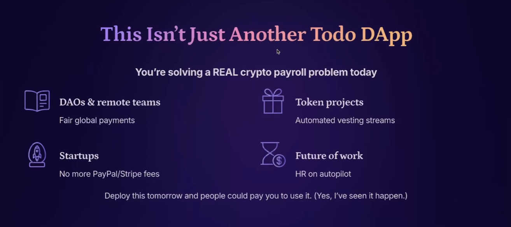
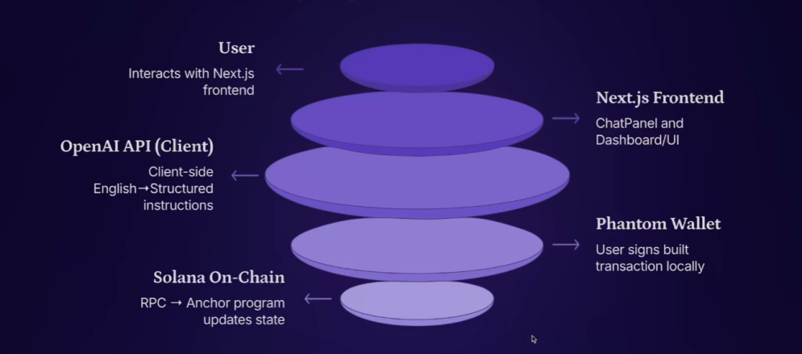

# CAPs — Cryptocurrency AI Payroll System

> **Natural language commands → on-chain SOL payments. No buttons. Just talk.**

---

## What Is CAPs?

CAPs is a fully on-chain, AI-powered payroll system built on Solana. Instead of clicking through dashboards and forms, you simply tell the AI what to do — in any language — and it handles the rest.

> *"Create organization Google"*
> *"Add worker 68Q... to Google salary 3.2 SOL"*
> *"Process payroll for Google"*

The AI interprets your instructions, constructs the appropriate on-chain transactions, and prompts you to authorize them via your wallet. No backend. No intermediary. Just you, the AI, and the blockchain.

---

## The Problem It Solves

For DAOs, remote teams, and startups operating across borders, traditional payroll is a mess — Stripe fees, PayPal friction, banking delays, FX conversion costs. All you really need is a wallet address.

CAPs eliminates that overhead entirely. As long as your organization's treasury holds SOL or USDC, the system handles recurring payments, one-time disbursements, and worker claims — fully on-chain and fully auditable.



---

## Technical Architecture

CAPs is designed with a zero-trust, serverless philosophy. The OpenAI integration runs **100% client-side** — no API keys exposed, no server in the middle. The only backend is the Solana blockchain itself.



---

## How CAPs Compares

| Feature | Traditional Payroll | Most Crypto Payroll | CAPs |
|---|---|---|---|
| Natural language control | ❌ | ❌ | ✅ |
| OpenAI key stored on server | ✅ | ✅ | ❌ Never leaves your browser |
| Fully on-chain & auditable | ❌ | ✅ | ✅ |
| Non-custodial wallet | ❌ | Sometimes | ✅ You always sign |
| Zero backend / no accounts | ❌ | ❌ | ✅ |

---

## Key Features

| Feature | Description |
|---|---|
| 🤖 **AI-driven UX** | Natural language replaces every button and form |
| 🌐 **Multilingual** | Give commands in any language |
| ⛓️ **Fully on-chain** | Payroll logic lives on Solana — transparent & auditable |
| 💸 **Zero-trust withdrawals** | Workers can claim their funds anytime, independently |
| 🔒 **No key exposure** | OpenAI runs client-side; no secrets on a server |
| 🏗️ **Built for DAOs & remote teams** | No Stripe, no PayPal — just wallet addresses |
| 🔑 **No login, no KYC** | Connect any Solana wallet (Phantom, Solflare, Backpack…) |

---

## How It Works

```
1. Create org          → "Create organization Google"                    (~10 seconds)
2. Add workers         → "Add worker Hx9... to Google salary 2 SOL"
3. Fund treasury       → "Fund Google with 50 SOL"
4. Natural language    → AI constructs payment streams from your command
5. Workers withdraw    → Any worker can claim their vested funds anytime
6. Audit anytime       → Every action is on-chain and publicly verifiable
```

**Example commands:**

| Goal | Command |
|---|---|
| List orgs | `Show my organizations` |
| Create org | `Create organization Google` |
| Add worker | `Add worker Hx9... to Google salary 4.5 SOL` |
| Fund treasury | `Fund Google with 100 SOL` |
| Run payroll | `Process payroll for Google` |
| Withdraw | `Withdraw 20 SOL from Google` |

---

## Quick Start

1. **Connect your Solana wallet** (Phantom, Solflare, Backpack, etc.)
2. **Paste your OpenAI API key** when prompted — it never leaves your browser
3. **Start chatting** — the AI remembers context and executes everything on-chain

---

## Tech Stack

### Frontend
- **Next.js 16** — App Router, Turbopack (~400% faster dev startup), native AI agent scaffolding
- **TypeScript / React / Tailwind CSS**

### AI Layer
- **OpenAI API** — Client-side streaming; zero server involvement, zero key exposure
- **MCP (Model Context Protocol)** — Anthropic's open standard for AI ↔ external tool integration (think: USB for AI). CAPs uses MCP tools to map natural language → on-chain function calls

### Blockchain
- **Solana** — High-throughput, low-fee L1
- **Anchor (Rust)** — Smart contract framework; programs: `create_org`, `add_worker`, `fund`, `payroll`, `withdraw`
- **Solana CLI + Wallet Adapter**

### Toolchain
- **Rust + Anchor CLI**
- **Node.js + npm / yarn**

---

## Project Structure

```
├── anchor/                   # Solana program (Rust + Anchor)
│   └── programs/payroll_program/
├── app/                      # Next.js pages
│   ├── dashboard/page.tsx    # AI chat + org panel
│   └── privacy/page.tsx
├── components/               # ChatPanel, OrganizationsPanel, Header…
├── lib/                      # MCP tools (AI → on-chain calls)
├── services/blockchain.ts    # Wallet + program interactions
└── utils/                    # Helpers & interfaces
```

---

## Local Development

```bash
git clone ...
cd caps
npm install

# Build & test the Anchor program
cd anchor
anchor build
anchor test

# Start dev server
cd ..
npm run dev
# → http://localhost:3000
```

---

## Roadmap

- [ ] Recurring payroll schedules (on-chain cron)
- [ ] Multi-sig treasuries
- [ ] Token payroll (USDC, custom SPL)
- [ ] Mobile wallet deep-linking
- [ ] Organization invites & permissions

---

## Why This Matters

CAPs is built for the next generation of organizations — DAOs, open-source collectives, remote-first startups — where contributors span time zones and borders. Fund a treasury, describe what you want, and the blockchain does the rest.
